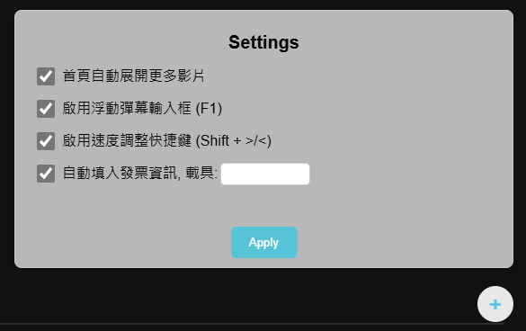

A Tampermonkey script that makes it more convenient to watch anime on [ani.gamer.com.tw](https://ani.gamer.com.tw/).

## Features

- [x] Auto expand the menu for more anime on the homepage.
- [x] (F1) Enable a floating danmuku input box. It allows you to focus on the anime while entering a danmuku. Suitable for both full and partial screen.
- [x] (Shift + >/<) Enable the shortcut to speed up/down the anime.
- [x] (Ctrl + F2) Skip forward 89 seconds. OP and ED are usually 90 seconds.
- [x] Auto input payment info (assigned to phone barcode), and auto click all check box.
